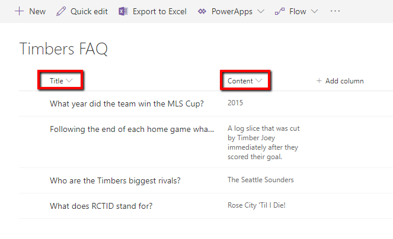
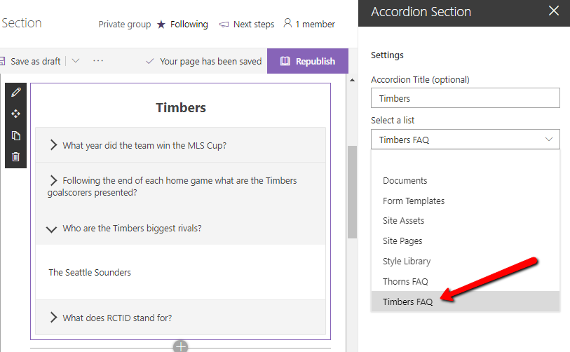

## SPFx Accordion Section FAQ Builder web part

* Adds a collapsible accordion section to an Office 365 SharePoint page or Teams Tab.
* Ideal for creating FAQs.
* When adding the web part, you'll be prompted to select a list from a property panel dropdown (target list must have a Title column and Content column).  This will generate an accordion with one section for each item in the list.
* Modifications/deletions/additions to the list items in the target list of an added web part are automatically reflected on the page.
* To deploy to a Teams tab see current [Microsoft documentation](https://docs.microsoft.com/en-us/sharepoint/dev/spfx/web-parts/get-started/using-web-part-as-ms-teams-tab).

## Usage

**1) Create or use a list with a Title and a Content column:**
* The value in the Title column for each item will appear in the heading bars of the Accordion.  
* The value in the Content column for each item will appear in the collapsible content section of the Accordion
* When creating the columns, select "Multiple lines of text".  Rich text is now supported within the Content column.

**2) Add the Accordion Section web part to your page & select your list:**  

## SharePoint Framework Version 
1.8.2

## Applies to

* [SharePoint Framework](https:/dev.office.com/sharepoint)
* [Office 365 tenant](https://dev.office.com/sharepoint/docs/spfx/set-up-your-development-environment)

## Solution

Solution|Author(s)
--------|---------
SPFx Collapsible Accordion Section|Erik Benke

## Version history

Version|Date|Comments
-------|----|--------
1.0|August 14, 2019|Initial release
1.1|September 19, 2019|Minor updates, adding to Github
1.2|April 15, 2020|Added Polyfills for IE11 compatibility
1.3|July 10, 2020|Adding Rich Text support for Content panels

### Testing and Deployment

- Clone or download this repository
- Run in command line:
  - `npm install` to install the npm dependencies
- To test:
  - `gulp serve --nobrowser`
  -  Test within a site in your tenant using the Remote Workbench by navigating to *https://\{yourtenant\}.sharepoint.com/sites/\{yoursite\}/_layouts/15/workbench.aspx*.  Use Lists within your site that follow the **Usage** guidelines above.  Local workbench testing not supported
- To package and deploy:
  - Use `gulp bundle --ship` & `gulp package-solution --ship`
  - Add the .sppkg to your SharePoint App Catalog

